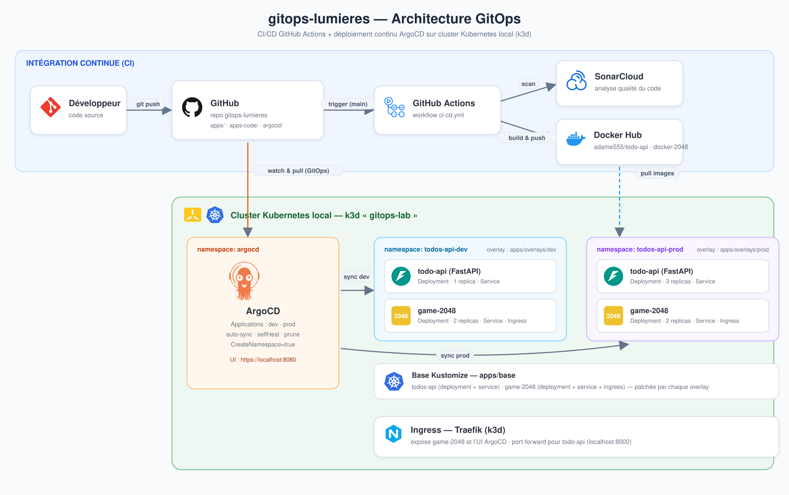

# gitops-lumieres

Repo GitOps pour le déploiement de la **todo-api** et du **game-2048** via ArgoCD sur un cluster Kubernetes local (k3d).

---

## Architecture



```
gitops-lumieres/
├── apps/
│   ├── base/                            # Manifests K8s de base (Kustomize)
│   │   ├── kustomization.yaml           # Déclare les apps : todos-api + game-2048
│   │   ├── todos-api/                   # Deployment + Service de la todo-api
│   │   └── game-2048/                   # Deployment + Service + Ingress du jeu 2048
│   └── overlays/
│       ├── dev/                         # Env dev  : ns todos-api-dev,  todo-api 1 replica
│       │   ├── todos-api/               # Patch replicas=1
│       │   └── game-2048/               # Patch host Ingress (game-dev.*)
│       └── prod/                        # Env prod : ns todos-api-prod, todo-api 3 replicas
│           ├── todos-api/               # Patch replicas=3
│           └── game-2048/               # Patch host Ingress (game-prod.*)
├── apps-code/
│   ├── docker-2048/                     # Code source + Dockerfile du jeu 2048
│   └── todo-api-python/                 # Code source de la todo-api (FastAPI)
├── argocd/
│   ├── applications/                    # Application CRDs ArgoCD
│   │   ├── argo-dev.yaml                # App dev  → namespace todos-api-dev
│   │   └── argo-prod.yaml               # App prod → namespace todos-api-prod
│   ├── ingress.yaml                     # Ingress Traefik pour l'UI ArgoCD
│   └── notifications-cm.yaml            # Notifications email (sync failed / health degraded)
└── .github/workflows/
    └── ci-cd.yml                        # CI : scan SonarCloud de la todo-api
```

---

## Applications déployées

| App | Image | Dev | Prod |
|-----|-------|-----|------|
| todo-api | `adame555/todo-api:v1.0.0` | 1 replica | 3 replicas |
| game-2048 | `adame555/docker-2048:v3` | 2 replicas | 2 replicas |

Les deux applications sont déclarées dans `apps/base` et partagent le namespace de chaque environnement (`todos-api-dev` en dev, `todos-api-prod` en prod).

---

## Prérequis

- [k3d](https://k3d.io/)
- [kubectl](https://kubernetes.io/docs/tasks/tools/)
- [ArgoCD CLI](https://argo-cd.readthedocs.io/en/stable/cli_installation/) (optionnel)

---

## Lancer depuis zéro

### 1. Créer le cluster

```bash
k3d cluster create gitops-lab
```

### 2. Installer ArgoCD

```bash
kubectl create namespace argocd
kubectl apply -n argocd -f https://raw.githubusercontent.com/argoproj/argo-cd/stable/manifests/install.yaml
kubectl wait --for=condition=available deployment/argocd-server -n argocd --timeout=180s
```

### 3. Déployer les Applications ArgoCD

```bash
kubectl apply -f argocd/applications/argo-dev.yaml
kubectl apply -f argocd/applications/argo-prod.yaml
```

ArgoCD synchronise automatiquement depuis ce repo Git et déploie les ressources dans les namespaces correspondants.

### 4. Exposer l'UI ArgoCD via Ingress

L'UI est exposée via Traefik (plus besoin de port-forward permanent). Le serveur doit servir en HTTP (Traefik termine la connexion) :

```bash
# Passer argocd-server en mode insecure
kubectl patch configmap argocd-cmd-params-cm -n argocd \
  --type merge -p '{"data":{"server.insecure":"true"}}'
kubectl rollout restart deployment argocd-server -n argocd

# Appliquer l'Ingress
kubectl apply -f argocd/ingress.yaml
```

### 5. (Optionnel) Activer les notifications email

```bash
kubectl apply -f argocd/notifications-cm.yaml

# Renseigner les identifiants SMTP Gmail (mot de passe d'application)
kubectl create secret generic argocd-notifications-secret -n argocd \
  --from-literal=email-username='ton-email@gmail.com' \
  --from-literal=email-password='mot-de-passe-application'
```

Les Applications `dev`/`prod` sont abonnées aux triggers `on-sync-failed` et `on-health-degraded` (voir annotations dans `argocd/applications/`).

---

## Accéder aux services

> Le cluster k3d expose Traefik via son loadbalancer sur `localhost:8080` (HTTP).
> Les hosts `*.127-0-0-1.sslip.io` résolvent vers `127.0.0.1` ; on y accède donc sur le port `8080`.

### UI ArgoCD

```bash
# Récupérer le mot de passe admin
kubectl -n argocd get secret argocd-initial-admin-secret \
  -o jsonpath="{.data.password}" | base64 -d ; echo
```

Ouvre **http://argocd.127-0-0-1.sslip.io:8080** (login: `admin`)

### todo-api (dev)

```bash
kubectl port-forward svc/todo-api -n todos-api-dev 8000:80
```

Endpoints disponibles :
- `GET  http://localhost:8000/todos/`
- `POST http://localhost:8000/todos/`
- `GET  http://localhost:8000/health`

### game-2048

Via l'Ingress (host différent par environnement) :
- dev  : **http://game-dev.127-0-0-1.sslip.io:8080**
- prod : **http://game-prod.127-0-0-1.sslip.io:8080**

Ou en port-forward :

```bash
kubectl port-forward svc/game-2048 -n todos-api-dev 8082:80
```

Ouvre **http://localhost:8082**

---

## Choix techniques

### Kustomize plutôt que Helm

Kustomize permet de séparer clairement la configuration de base des surcharges par environnement sans templating complexe. Les deux apps (todo-api + game-2048) sont déclarées une seule fois dans `apps/base`, et chaque overlay (`dev`/`prod`) ne fait qu'« appeler » la base puis patche ce qui diffère (replicas, namespace).

### Apps déclarées dans la base, appelées par les overlays

`apps/base/kustomization.yaml` agrège les manifests des deux applications. Chaque overlay référence `../../base` et applique son `namespace:` global, ce qui place toutes les ressources dans le namespace de l'environnement. game-2048 n'embarque donc plus son propre namespace.

### Un seul cluster, deux namespaces communs

- `todos-api-dev` → environnement de développement (todo-api 1 replica + game-2048)
- `todos-api-prod` → environnement de production (todo-api 3 replicas + game-2048)

### Accès local via Traefik + sslip.io

k3d expose Traefik sur `localhost:8080`. Les Ingress utilisent des hosts `*.127-0-0-1.sslip.io` (résolution DNS automatique vers `127.0.0.1`), ce qui évite d'éditer `/etc/hosts`. Chaque overlay patche le host de game-2048 pour éviter tout conflit de route Traefik entre dev et prod.

### CI : SonarCloud

Le workflow `.github/workflows/ci-cd.yml` lance un scan qualité SonarCloud sur le code de la todo-api (`apps-code/todo-api-python`) à chaque push sur `main`. Nécessite le secret GitHub `SONAR_TOKEN`.

### Notifications ArgoCD

`argocd/notifications-cm.yaml` configure des alertes email (Gmail SMTP) déclenchées quand une application passe en `Degraded` ou qu'une synchronisation échoue. Les destinataires sont définis via les annotations `notifications.argoproj.io/subscribe.*` sur chaque Application.

---

## Environnements

| Namespace | App | Replicas | Géré par |
|-----------|-----|----------|----------|
| `todos-api-dev` | todo-api | 1 | ArgoCD app `dev` |
| `todos-api-dev` | game-2048 | 2 | ArgoCD app `dev` |
| `todos-api-prod` | todo-api | 3 | ArgoCD app `prod` |
| `todos-api-prod` | game-2048 | 2 | ArgoCD app `prod` |
